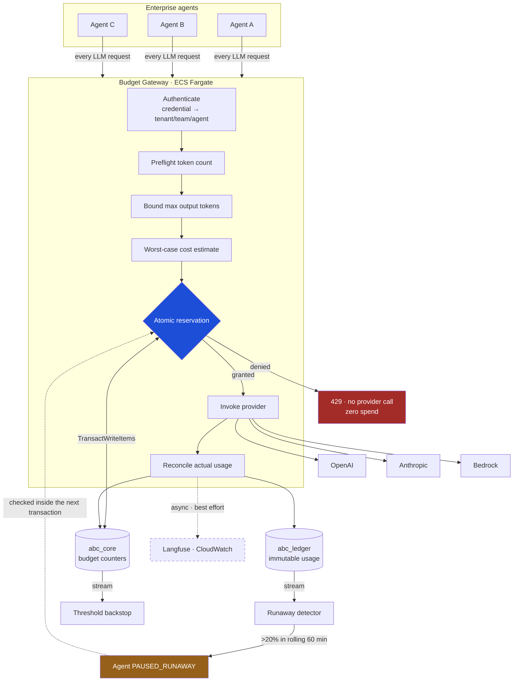
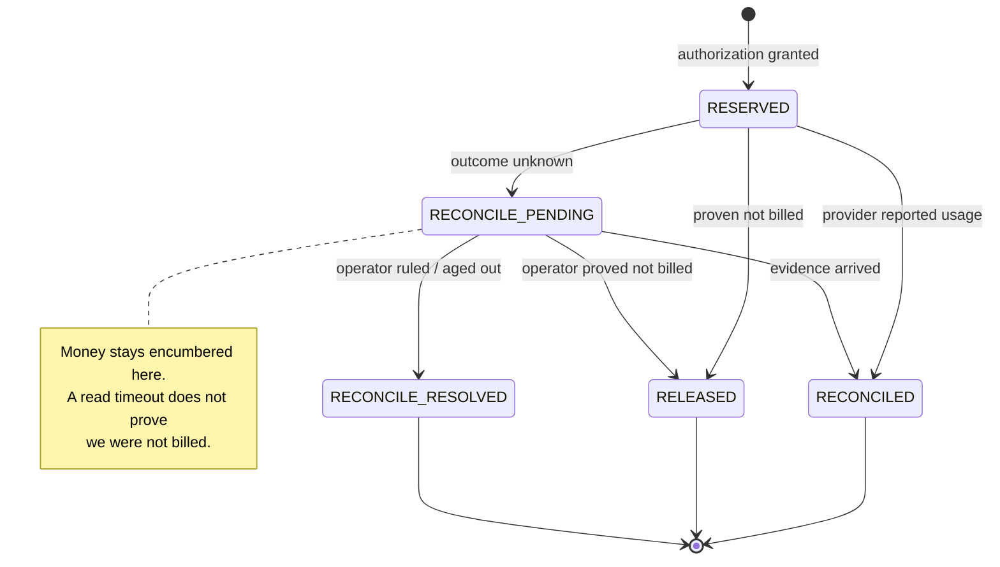
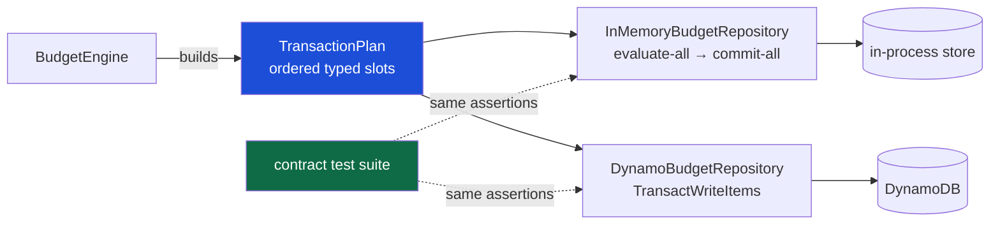
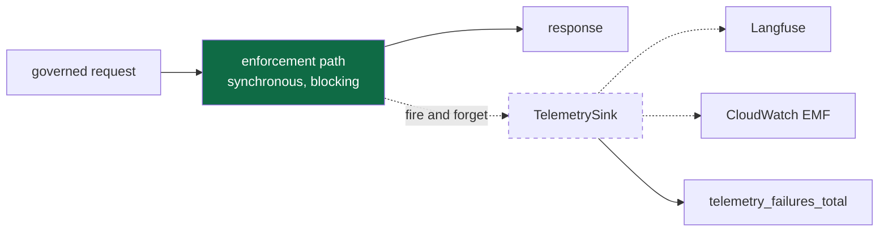

# Architecture

How the system is put together, and why each seam falls where it does.

Prerequisite: [PROJECT_CONTEXT.md](PROJECT_CONTEXT.md) for the problem statement
and the guarantee. This document assumes you already accept *why* reserve-before-
inference is necessary and want to know *how* it is implemented.

---

## System topology



The dashed edge is load-bearing: **Langfuse, the dashboard and the WebSocket sit
outside the authorization path**. If all three are down, enforcement continues
unaffected. There is an explicit failure-injection test for that.

---

## The request lifecycle

```mermaid
sequenceDiagram
    participant C as Client (agent)
    participant G as Gateway
    participant D as DynamoDB
    participant P as Provider

    C->>G: POST /v1/chat/completions
    G->>G: resolve identity from credential
    Note over G: the caller never asserts who it is

    G->>P: count input tokens (preflight)
    P-->>G: token count
    G->>G: bound output = min(client, policy, model)
    G->>G: estimate worst-case cost

    rect rgb(29, 78, 216, 0.10)
    Note over G,D: One atomic TransactWriteItems
    G->>D: reserve across team + agent + session + allocation<br/>+ ConditionCheck agent status<br/>+ ConditionCheck session status
    alt any condition fails
        D-->>G: TransactionCanceledException
        G-->>C: 429 — naming the blocking scope
        Note over P: provider is never called
    else all conditions pass
        D-->>G: reservation granted
    end
    end

    G->>D: mark_dispatched (PRE_DISPATCH → DISPATCHED)
    G->>P: invoke, with the hard output cap
    P-->>G: completion + reported usage

    G->>D: reconcile — reserved → committed at actual cost<br/>+ append immutable ledger entry
    G->>D: second txn: 80% threshold flip / session closure
    G-->>C: 200 + budget metadata headers
    G--)Note over G: telemetry, fire-and-forget
```

Two details in that diagram are easy to skim past and matter a great deal:

**`mark_dispatched` is a separate write.** It flips the reservation from
`PRE_DISPATCH` to `DISPATCHED` immediately before the socket write. That single
extra write is what lets a sweeper distinguish a gateway that crashed *before*
reaching the provider (safe to release) from one that crashed *after* (must be
held). Without it, every crashed request would encumber its budget indefinitely.

**Thresholds and session closure are a *second* transaction.** They cannot be
folded into the reconcile: DynamoDB conditions evaluate the *pre*-update image, so
"did this update push us past 80%?" is inexpressible inline — and the
`warning_80_sent` flag lives on the very item reconcile is already writing, which
a transaction may touch only once.

---

## The reservation state machine



The important edge is the one that **does not exist**: there is no automatic
`RECONCILE_PENDING → RELEASED`. Ambiguity only resolves to "not billed" through
explicit evidence or an operator decision. See
[DECISIONS.md](DECISIONS.md#d5-ambiguity-holds-the-money).

### How an outcome is classified

`providers/classify.py` is the highest-stakes small function in the codebase — its
answer decides whether money goes back to the budget or stays held.

| Outcome | Meaning | Effect on the reservation |
|---|---|---|
| `Succeeded` | Completion returned with usage | Reconcile at actual cost |
| `FailedBilled` | Failed *after* generation (e.g. content filter) | Reconcile — tokens were generated and billed |
| `FailedNotBilled` | **Proven** never metered | Release the hold |
| `FailedAmbiguous` | Anything else — the default | Hold as `RECONCILE_PENDING` |

`FailedNotBilled` requires membership in an explicit allow-list: DNS failure,
refused connection, TLS handshake failure, local validation error, or a 4xx
carrying a parsed provider error envelope with no usage object. Note that
`ConnectTimeout` qualifies (the connection was never established) while
`ReadTimeout` does not (the request was sent and may have been served). Collapsing
those two into "timeout" is the single easiest way to introduce a double-spend.

---

## Layering

```
apps/gateway/src/abc_gateway/
│
├── domain/          pure values and functions — zero I/O
│                    money, tokens, windows, scopes, reservations, policy
│
├── pricing/         versioned catalog + cost arithmetic
│                    the only place Decimal is used
│
├── engine/          the enforcement rules
│                    reserve · reconcile · release · routing · thresholds
│
├── repo/            persistence — plans compiled by two backends
│   ├── memory/      in-process, full semantics (not a stub)
│   └── dynamo/      TransactWriteItems
│
├── providers/       OpenAI · Anthropic · Bedrock · fake
│                    all provider-specific parsing lives here and nowhere else
│
├── auth/            credential → tenant/team/agent
├── runaway/         rolling-window detector + human review
├── api/             FastAPI control plane and data plane
└── observability/   logs, metrics, Langfuse — all non-blocking
```

The dependency rule is strict and one-directional: `domain` knows nothing about
storage, HTTP, or providers. `engine` knows `domain` and the repository
*protocol*, never a concrete backend. This is what makes the enforcement rules
testable exhaustively without a network, a container, or a cloud account.

### Module map

| Module | Responsibility |
|---|---|
| `domain/money.py` | Integer nano-USD. Defines no `__float__`, no `__truediv__`. |
| `domain/window.py` | Resolves an instant → deterministic storage key. Pure computation. |
| `domain/scopes.py` | The TEAM→AGENT→SESSION→ALLOCATION hierarchy and per-request deltas. |
| `domain/state.py` | Budget counters. Schema dictated by DynamoDB's lack of condition arithmetic. |
| `domain/reservation.py` | The reservation record and its state machine. |
| `domain/usage.py` | Raw → normalised usage. Guards the non-additive token double-count trap. |
| `domain/errors.py` | Typed denials carrying the blocking scope and stable machine codes. |
| `pricing/catalog.py` | Per-million-token integer rates; worst-case and actual costing. |
| `pricing/loader.py` | Parses the catalog with `Decimal`, rejecting anything inexact. |
| `engine/budget_engine.py` | **The core.** Authorize, reconcile, release, mark-pending. |
| `engine/scope_resolver.py` | Policy → deduplicated `(scope, window)` vector. |
| `engine/effects.py` | The post-settlement second transaction. |
| `engine/routing.py` | Capability- and price-aware fallback under budget pressure. |
| `repo/plans.py` | `TransactionPlan` — backend-agnostic typed slots. |
| `repo/dynamo/expressions.py` | The condition expressions. The invariant lives here. |
| `repo/memory/_txn.py` | In-process engine mirroring commit-time condition evaluation. |
| `providers/classify.py` | Billed / not-billed / ambiguous. Fails closed. |
| `auth/identity.py` | Credential → governance identity. Callers never self-assert. |
| `runaway/detector.py` | Rolling 60-minute circuit breaker. |
| `api/service.py` | The lifecycle, in order. |

---

## The two-backend repository pattern

The engine never speaks DynamoDB. It builds a **plan** — an ordered list of typed
slots describing what must be checked and what must change — and hands it to a
repository.



This exists for one reason: **34 contract tests run identically against both
backends**. Without that, the fast in-memory backend would be a comfortable
fiction — green tests saying nothing about production behaviour.

Slot *order* is load-bearing. DynamoDB reports a cancelled transaction as a list
aligned index-for-index with the actions submitted, so mapping reason N back to
slot N is the only way to answer "which scope rejected this request?". Reordering
slots would silently corrupt every error message the system produces.

---

## Routing and model substitution

When a model's own allocation is exhausted, the gateway may fall back to a cheaper
model. Three rules govern that, each because violating it turns a cost control
into a different kind of bug:

**Fallback may only escape the allocation.** If the denial came from the team,
agent, or session scope, the chain aborts immediately. Those scopes are in every
candidate's transaction anyway — so a fallback *could not* spend past them even if
it tried — but aborting early gives the caller the truthful error ("your agent
budget is gone") instead of a misleading one ("no model was available").

**Cheaper ≠ interchangeable.** Capabilities are checked before price. A fallback
whose context window is too small for the prompt, or that cannot accept the
request's tools, does not save money — it fails, or silently returns something
worse.

**"Cheaper" is verified, not assumed.** The estimated worst-case cost of the
*actual request* is computed for both models and compared. A configured "fallback"
that is dearer for a particular prompt shape is refused.

Substitution is never silent. The decision, both model names, and the estimated
saving travel back in response headers.

---

## Runaway detection

An agent spending more than 20% of its monthly budget inside a rolling 60-minute
window is paused for human review.

The window is **rolling, not calendar-aligned**, because hourly buckets have a
blind spot exactly where it matters:

```mermaid
gantt
    title A burst that calendar-hour buckets miss
    dateFormat HH:mm
    axisFormat %H:%M

    section Calendar hours
    hour 11 sees $7 — under threshold     :done, 11:00, 60m
    hour 12 sees $7 — under threshold     :done, 12:00, 60m

    section Actual burst
    $14 spent in 20 minutes               :crit, 11:50, 20m

    section Rolling 60 min
    window sees $14 — TRIPPED             :active, 11:20, 60m
```



A burst straddling the boundary is exactly the shape a recursive loop produces, so
the cheaper implementation is blind to the case it exists to catch. Spend
accumulates into one-minute buckets and the last sixty are summed.

Delivery is **at-least-once**, so every ledger entry carries a stable `entry_id`
and a marker item records that it has been counted. A redelivery adds nothing — a
duplicate must not be able to manufacture a runaway that never happened and pause
a healthy agent.

---

## Identity

The single rule: **a caller never asserts who it is.**

A header like `X-Agent-ID: cheap-agent` is worthless as identity, because a caller
wanting a bigger budget just sends a different value. Any agent could spend any
other agent's money and the entire hierarchy would be decorative.

```
API key / JWT subject / workload identity
            ↓  (resolved server-side)
    tenant → team → agent
```

A session id *may* come from the client, because it is a correlation handle rather
than an authorisation — but it is verified to belong to the authenticated agent
before it is honoured.

There is an e2e test that sends a deliberate `X-Agent-ID` impersonation attempt
and asserts the spend lands on the authenticated agent regardless.

---

## The observability boundary



Every emission is wrapped, every failure is swallowed *after being counted*, and
nothing here is ever awaited on the authorization path. The
`telemetry_failures_total` counter exists precisely so that "we are flying blind"
is itself visible rather than silent.

Prompt and response content is **not** captured by default. Token counts, costs,
latency, model choice and routing decisions explain a run perfectly well without
copying conversation content into a third-party system.

---

## Further reading

- [DATA_MODEL.md](DATA_MODEL.md) — the DynamoDB layout and exact transaction shapes
- [DECISIONS.md](DECISIONS.md) — why each of these choices was made
- [TESTING.md](TESTING.md) — how the invariant is actually proven
