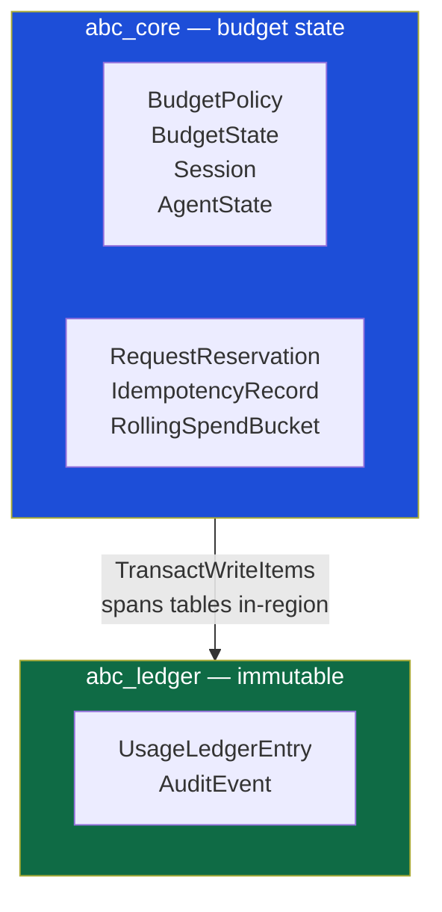

# Data Model

The DynamoDB layout, and the reasoning behind every deliberate choice in it.

Source of truth: `infra/table_core.json` and `infra/table_ledger.json` — these
files are used **verbatim** by the test suite (`tests/contract/conftest.py`) and
mirrored by Terraform (`infrastructure/terraform/main.tf`), so the schema proven
in tests cannot drift from the schema deployed. Key formats are centralised in
`apps/gateway/src/abc_gateway/repo/keys.py`.

---

## Two tables, and why



Three reasons the ledger lives in its own table:

1. **Immutability becomes an IAM guarantee, not a code convention.** The
   gateway's task role gets `PutItem` on `abc_ledger` but not `UpdateItem` or
   `DeleteItem` (see `infrastructure/terraform/iam.tf`). A single table cannot
   express that, because the same role must be able to update budget counters.
2. **A clean one-event-per-record stream.** The runaway detector reads
   `abc_ledger`'s stream, and every record there is exactly one financial event
   with a stable `entry_id`. Sharing a table would mean filtering millions of
   counter mutations to find the events that matter.
3. **Splitting costs no atomicity.** `TransactWriteItems` spans tables within a
   region, so reconciliation still writes counters and the ledger entry together
   or not at all.

---

## The enabling constraint

Everything about the `abc_core` counter schema follows from one fact:

> **DynamoDB `ConditionExpression` has no arithmetic.**

You cannot write `committed + reserved + :cost <= limit` as a condition. You
*can* write `remaining_nano >= :cost`. So `remaining` is maintained as a
**materialised, decrementing counter** — seeded and decremented in a single
expression:

```
SET remaining_nano = if_not_exists(remaining_nano, :limit) - :cost
ADD reserved_nano :cost
```

`committed` and `reserved` are kept alongside purely for reporting and for the
accounting identity every property test asserts after each operation:

```
remaining + committed + reserved == limit
```

See [DECISIONS.md #D1](DECISIONS.md#d1-money-is-materialised-not-derived) for the
full reasoning, including the lazy-window-creation subtlety this forces.

---

## Item layout, `abc_core`

| Entity | PK | SK | Notes |
|---|---|---|---|
| **BudgetPolicy** | `TNT#{tenant}#BUDGET#{scope}` | `POLICY#CURRENT` | Configuration; read outside the authorization transaction |
| **BudgetState** | `TNT#{tenant}#BUDGET#{scope}` | `WINDOW#{TYPE}#{id}` | The counters. Window is part of the key — see below |
| **AgentState** | `TNT#{tenant}#AGENT#{agent}` | `STATE` | Status only |
| **AgentPolicy** | `TNT#{tenant}#AGENT#{agent}` | `POLICY#CURRENT` | Routing, budget, runaway config |
| **Session** | `TNT#{tenant}#SESSION#{session}` | `META` | Lifecycle status only |
| **RequestReservation** | `TNT#{tenant}#REQ#{reservation_id}` | `RESERVATION` | The undo vector for settlement |
| **IdempotencyRecord** | `TNT#{tenant}#IDEM#{key_hash}` | `IDEM` | Durable, independent of DynamoDB's own token |
| **RollingSpendBucket** | `TNT#{tenant}#AGENT#{agent}` | `ROLL#{minute}` | One-minute spend bucket for the runaway detector |
| **RollingMark** | `TNT#{tenant}#ROLLMARK#{entry_id}` | `MARK` | Dedup marker for at-least-once stream delivery |
| **AlertEvent** | `TNT#{tenant}#BUDGET#{scope}` | derived from scope+window+kind | Deterministic key — see below |

### Why status and counters are deliberately separate items

`AgentState` (`SK=STATE`) is a different item from the agent's `BudgetState`
(`SK=WINDOW#...`). Same for `Session` (`SK=META`) versus its budget counters.

This is not incidental. DynamoDB forbids two actions against the same item inside
one transaction, and authorization needs to **check status and decrement counters
in the same transaction** — checking status via a prior read would leave a window
in which a pause lands and one more request still gets through, which is exactly
the situation a runaway agent produces. Splitting the items is what makes both
things legal at once.

### Window keys, not TTL

```
BUDGET#TEAM#engineering / WINDOW#MONTH#2026-08
BUDGET#TEAM#engineering / WINDOW#MONTH#2026-09
```

DynamoDB TTL deletes expired items only *eventually* — AWS documents lag measured
in days. A design that waited for August's row to disappear before starting
September would keep charging September traffic against August's exhausted
budget. Making the window part of the key removes the question: at the boundary,
requests simply address a different item. `housekeeping_ttl` may still garbage-
collect history; it never decides authorization.

### Deterministic alert keys

```python
def sort_key(self) -> str:
    window_part = self.window.sort_key().removeprefix("WINDOW#") if self.window else "LIFETIME"
    return f"ALERT#{window_part}#{self.kind.value}"
```

Because this key is *derived* rather than random, a conditional `Put` on it is
itself an independent exactly-once guarantee — a duplicate attempt collides with
the existing item rather than creating a second alert, regardless of whether the
`warning_80_sent` flag flip also caught it.

---

## Global secondary indexes, `abc_core`

| Index | Key | Purpose |
|---|---|---|
| **GSI1** | `GSI1PK` / `GSI1SK` | Dashboard rollups — every `BudgetState` of a given scope type in a window |
| **GSI2** | `GSI2PK` / `GSI2SK` | **Sparse.** Only unsettled `RequestReservation`s appear here — entries are removed on settlement, so the stale-reservation sweeper scans only outstanding work, never the full reservation history |

---

## Item layout, `abc_ledger`

| Entity | PK | SK |
|---|---|---|
| **UsageLedgerEntry** | `TNT#{tenant}#LEDGER#{agent}#{yyyy-mm}` | `{created_at_micros}#{reservation_id}#{seq}` |
| **AuditEvent** | `TNT#{tenant}#AUDIT#{yyyy-mm-dd}` | ordinal |

**GSI1** (`GSI1PK`/`GSI1SK`) gives a time-ordered per-agent view, so an audit over
a date range is a range scan rather than a filtered scan.

### Ledger entries are append-only, corrections supersede

A `kind=CORRECTION` entry points at the entry it supersedes via
`corrects_entry_id`. The original is **never touched**. This is what makes the
ledger trustworthy as evidence — an auditor asking "what did we think we spent,
and when did we learn otherwise?" gets both records, not an overwritten one.

Every entry pins `price_catalog_version`. Reconciliation prices at the version
**pinned on the reservation**, never the currently-active one — a price update
must never silently rewrite historical spend.

---

## The counter fields on `BudgetState`

| Field | Meaning |
|---|---|
| `remaining_nano` | The materialised counter the authorization condition reads |
| `committed_nano` | Settled spend (reconciled) |
| `reserved_nano` | Held against requests currently in flight |
| `pending_nano` | Subset of `reserved` whose provider outcome is unknown — **reporting only**, not an additional deduction |
| `overage_nano` | Actual spend that exceeded its reservation. Should always be zero; alarmed, not dashboarded |
| `open_reservations` | Count of live reservations, for leak detection |
| `warning_80_sent` | One-shot flag, flipped conditionally |
| `committed_input_tokens` / `output` / `total` | Token quota tracking, independent of money |

The identity every property test checks:

```
remaining + committed + reserved == limit
```

This is deliberately silent about `overage`. If a provider generates past the
hard cap sent to it, `committed` simply grows beyond `limit` and `remaining` goes
negative — and the identity still holds. `overage` is a diagnostic counter for
alerting, not a term in the accounting. See
[DECISIONS.md #D6](DECISIONS.md#d6-overage-is-recorded-honestly-not-hidden).

---

## The authorization transaction, concretely

One `TransactWriteItems` call, built from a `TransactionPlan`
(`repo/plans.py`). For a request touching team, agent, session, and a model
allocation:

```
Slot 0   Update  BUDGET#TEAM#{team}      / WINDOW#MONTH#{ym}     — reserve
Slot 1   Update  BUDGET#AGENT#{agent}    / WINDOW#MONTH#{ym}     — reserve
Slot 2   Update  BUDGET#SESSION#{sess}   / WINDOW#SESSION#{sess} — reserve
Slot 3   Update  BUDGET#ALLOC#{agent}#{provider}::{model} / WINDOW#MONTH#{ym} — reserve
Slot 4   Check   AGENT#{agent} / STATE                            — status == ACTIVE
Slot 5   Check   SESSION#{sess} / META                            — status == OPEN
Slot 6   Put     IDEM#{key_hash} / IDEM                           — idempotency claim
Slot 7   Put     REQ#{reservation_id} / RESERVATION               — the reservation record
```

Every reserve slot's condition, in full:

```
ConditionExpression:
  attribute_not_exists(PK) OR (
    remaining_nano   >= :cost      AND
    remaining_input  >= :in_tok    AND
    remaining_output >= :out_tok   AND
    remaining_total  >= :tot_tok
  )

UpdateExpression:
  SET remaining_nano = if_not_exists(remaining_nano, :limit) - :cost, ...
  ADD reserved_nano :cost, reserved_input :in_tok, ..., open_reservations :one
```

The `attribute_not_exists(PK) OR ...` is not optional. Without it, a second
concurrent *first* request to a brand-new window would find the item already
created by the first and be spuriously rejected — precisely the millisecond after
a window boundary, when traffic spikes. `SET ... = if_not_exists(x, :limit) - :cost`
rather than `ADD` is what lets that same expression create-and-decrement
atomically; `ADD` on an absent attribute would yield `-cost`, not `limit - cost`.

Every action carries `ReturnValuesOnConditionCheckFailure: ALL_OLD`. Without it, a
denial can only say "a condition failed on the team budget." With it, the API
returns the exact balance and shortfall — see the error shape in
[API.md](API.md#errors).

**Slot order is load-bearing.** DynamoDB reports a cancelled transaction as
`CancellationReasons`, a list positionally aligned with the submitted actions.
`repo/dynamo/client.py::decode_cancellation` maps reason index N back to slot N.
Reordering slots would silently attribute a denial to the wrong scope.

---

## Reconciliation, concretely

Driven from the reservation's *stored* scope vector — never recomputed from
current policy, because policy may have changed between reserve and settle, and
reversing a hold using today's policy instead of the amount actually taken would
corrupt the counters.

```
Slot 0     Update  RESERVATION      — state RESERVED → RECONCILED (conditional)
Slot 1..N  Update  each held scope  — reserved -= held; committed += actual
Slot N+1   Put     LEDGER entry     — immutable, kind=USAGE
[Slot N+2] Put     LEDGER entry     — kind=OVERAGE, only if actual > reserved
```

The settle condition is deliberately **not** a budget check:

```
ConditionExpression: attribute_exists(PK) AND reserved_nano >= :reserved
```

Recording what a provider actually charged us must never be refused by a budget
condition — the only guard is the accounting sanity check that the hold being
reversed actually exists. See
[DECISIONS.md #D6](DECISIONS.md#d6-overage-is-recorded-honestly-not-hidden).

---

## The two threshold/closure follow-up transactions

Run **after** reconciliation commits, for two reasons: conditions evaluate the
pre-update image (so "did this cross 80%?" can't be inline), and the flag being
flipped lives on the item reconciliation is already writing.

```
Threshold flip:
  ConditionExpression: warning_80_sent = false AND remaining_nano <= :floor
  UpdateExpression:    SET warning_80_sent = true

Session close (path A — exact cap):
  ConditionExpression: status = OPEN AND remaining_nano <= 0
  UpdateExpression:    SET status = CLOSED_BUDGET
```

Both run twice, deliberately: an inline fast path immediately after reconcile
(sub-millisecond alerting), and a **stream backstop** consuming the `abc_core`
stream that retries the identical idempotent transaction. If the gateway process
dies between reconcile and the inline attempt, the guarantee still lands via the
stream. Session closure **path B** — the next request would exceed the cap — runs
inside the *authorization* transaction's denial instead, reading the pre-image
DynamoDB already returned, at no extra cost.

---

## Table specs are shared, not duplicated

```
infra/table_core.json    ──┬──▶ tests/contract/conftest.py  (moto CreateTable)
infra/table_ledger.json  ──┘──▶ infrastructure/terraform/main.tf  (aws_dynamodb_table)
```

If the schema tests prove against ever drifts from the schema Terraform deploys,
it will be because someone edited one file and not the other — there is exactly
one place to make the schema change correctly.

---

## Further reading

- [DECISIONS.md](DECISIONS.md) — the *why* behind each schema choice
- [ARCHITECTURE.md](ARCHITECTURE.md) — how this fits into the request lifecycle
- [TESTING.md](TESTING.md) — how both backends are proven to agree
