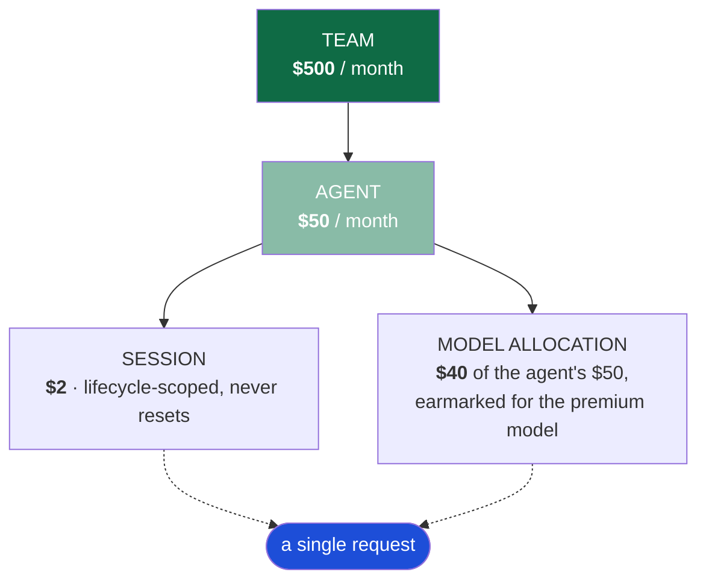

# Project Context

**Start here.** This document orients you in about five minutes: what this system
is, the problem it solves, what exists today, and what has actually been proven.

---

## What it is

A **financial authorization gateway for AI inference**. Not a cost dashboard.

Every governed request has its worst-case cost reserved — atomically, across every
applicable budget — *before* it is allowed to reach an LLM provider. If the
reservation fails, the provider is never called and nothing is spent.

The single guarantee the entire system exists to provide:

```
For every governed scope S:   committed_S + reserved_S  ≤  limit_S
```

...and that holds while many agents spend concurrently from overlapping budgets.

---

## The problem

An enterprise gives its engineering team an LLM budget. Agents run across several
products. One of them enters a recursive loop and makes tens of thousands of API
calls before anyone notices.

Billing dashboards cannot prevent this. By the time spend is visible, the money is
already gone. The only thing that helps is refusing the request *before* it
reaches the provider.

### Why post-hoc metering cannot work

An agent has **$0.10** left. Three requests arrive simultaneously, each costing up
to $0.06:

```
Worker A  reads remaining = $0.10  → allowed
Worker B  reads remaining = $0.10  → allowed
Worker C  reads remaining = $0.10  → allowed
                                     ↓
                          all three call the provider
                                     ↓
                              actual spend: $0.18
```

Every worker checked the budget. The budget was still blown — because *checking*
and *charging* were two separate operations, and three workers slipped between
them.

The fix is to make them one operation. That is what this system does, and
everything else in it follows from that requirement.

---

## The lifecycle

Strictly ordered. The order is the design.

```
count → bound → estimate → RESERVE → invoke → reconcile
```

| Step | What happens |
|---|---|
| **count** | Count the prompt's input tokens (via the provider's own counting endpoint where one exists). |
| **bound** | Force an output ceiling: `min(client_requested, policy_cap, model_cap)`. If the client omitted one, inject the policy cap. |
| **estimate** | Compute the *worst-case* cost of those bounds at the pinned price catalog. |
| **RESERVE** | Atomically hold that amount against every applicable budget, or refuse. |
| **invoke** | Only now may the provider be called. |
| **reconcile** | Replace the held estimate with provider-reported actual usage; return the difference. |

The forbidden inverse — call the provider, then add up the bill — is precisely
what makes existing tooling *observability* rather than *enforcement*.

---

## The budget hierarchy



A request is legal only if it fits inside **every** applicable scope
simultaneously — which is why authorization is one atomic transaction rather than
four sequential checks.

Two things about this shape are worth understanding early:

**Model allocation is a *sub-budget* of the agent, not a parallel budget.** The
agent gets $50, of which $40 is earmarked for the premium model. When that $40 is
exhausted, $10 of agent budget remains for a cheaper fallback — and not a cent
more. This is what makes "reroute to a cheaper model" coherent; read against the
agent's *total* budget it would be nonsense.

**Session budgets never reset.** They are scoped to a conversation, not a calendar
period. When one runs out the session *closes* rather than continuing to reject
requests one at a time.

---

## What exists

| Component | Location | What it does |
|---|---|---|
| **Gateway** | `apps/gateway/` | FastAPI service. Control plane + OpenAI-compatible data plane. The enforcement engine lives here. |
| **Stream processor** | `apps/stream_processor/` | Lambda on DynamoDB Streams. Runaway detection and the threshold-warning backstop. |
| **Dashboard** | `apps/dashboard/` | Next.js operator UI — committed vs. reserved vs. available, ledger, audit trail. |
| **Infrastructure** | `infrastructure/terraform/` | VPC, ECS Fargate, ALB, DynamoDB, Lambda, IAM, KMS, alarms. |
| **Table specs** | `infra/table_*.json` | DynamoDB `CreateTable` specs — used by *both* the tests and Terraform, so schema cannot drift. |
| **Price catalog** | `pricing/catalog.json` | Versioned, per-million-token rates. Every ledger entry pins the version used. |

Roughly 17,000 lines of Python, 1,200 of Terraform, 1,000 of TypeScript.

---

## What has actually been proven

**214 tests pass** across seven suites in about 30 seconds, with no network calls
and no spend. Four quality gates are clean: `ruff`, `ruff format`, `mypy --strict`,
and `terraform validate`.

| Requirement | Status | Evidence |
|---|---|---|
| Hard-cap race | ✅ | $0.05 remaining, 10 concurrent × $0.04 → exactly 1 authorized, provider invoked exactly once |
| Three-agent concurrency | ✅ | Team $1.00 / three $0.50 agents; invariant holds at every scope; zero leaked reservations |
| 80% warning | ✅ | Exactly one warning, including under 20 concurrent reconciliations |
| 100% hard block | ✅ | `429`, provider invocation count unchanged |
| Session closure | ✅ | Both exact-cap and would-exceed paths |
| Model substitution | ✅ | Capability-checked, verified cheaper, cannot escape the parent cap |
| Runaway detector | ✅ | Hour-straddling bursts trip it; duplicate stream events do not |
| Token governance | ✅ | Quotas reject while dollars remain; no cached/reasoning double-counting |
| Ambiguous outcomes | ✅ | Read timeout retains its reservation |
| Idempotency | ✅ | Replay returns stored response without a second provider call |
| Both storage backends agree | ✅ | 34 contract tests run identically against in-memory and DynamoDB-via-moto |

### What has *not* been proven

Three items are credential- or software-gated. They are reported as unverified
rather than inferred from a passing local proxy:

| Item | Why not verified |
|---|---|
| **AWS deployment** | No AWS credentials were supplied. Terraform validates; it has never been applied. |
| **Live provider E2E** | No OpenAI or Anthropic API key was supplied. Adapters are complete and unit-tested against recorded response shapes, but no real API call has been made. |
| **Container build** | Docker is not installed on the development machine. The `Dockerfile` and compose stack are written but unbuilt. |

See [OPERATIONS.md](OPERATIONS.md#closing-the-unverified-items) for what closing
each of these requires.

---

## Try it in two minutes

```bash
make setup                                    # venv + pinned dependencies
make run                                      # gateway on http://localhost:8080
```

Then, in another terminal:

```bash
PYTHONIOENCODING=utf-8 \
GATEWAY_URL=http://127.0.0.1:8080 \
ABC_ADMIN_API_KEY=local-admin-key \
python scripts/demo.py
```

The demo walks nine governance behaviours end to end and asserts at every step:
normal traffic, the 80% warning, allocation exhaustion and substitution, the hard
cap with a zero-provider-call proof, session closure, a runaway pause that leaves
sibling agents working, an audited resume, and the ledger showing estimate beside
actual.

---

## Where to go next

| If you want to… | Read |
|---|---|
| Understand how it works internally | [ARCHITECTURE.md](ARCHITECTURE.md) |
| Understand the DynamoDB layout | [DATA_MODEL.md](DATA_MODEL.md) |
| Understand *why* it's built this way | [DECISIONS.md](DECISIONS.md) |
| Learn what the build taught us | [FINDINGS.md](FINDINGS.md) |
| Call the API | [API.md](API.md) |
| Run, deploy, or debug it | [OPERATIONS.md](OPERATIONS.md) |
| Understand the test strategy | [TESTING.md](TESTING.md) |
| Read the original requirements | [spec/](spec/) |

---

## What this is *not*

This does not claim that LLM budgets are a new idea. OpenAI and Anthropic both
offer organization-level spend caps. LiteLLM, Portkey and Helicone all offer
budget policies of various shapes. Langfuse does LLM observability far better than
anything here.

What is built here is the **enforcement plane underneath**: a deterministic,
hierarchical, reserve-before-inference authorization gateway whose invariant is
proven under concurrency — with the failure modes that actually bite (ambiguous
provider outcomes, duplicate stream delivery, crashed gateways, window boundaries,
provider overshoot) handled explicitly rather than hoped away.

Langfuse is integrated deliberately as the *observability* layer beside it, and
deliberately cannot break enforcement when it fails.
