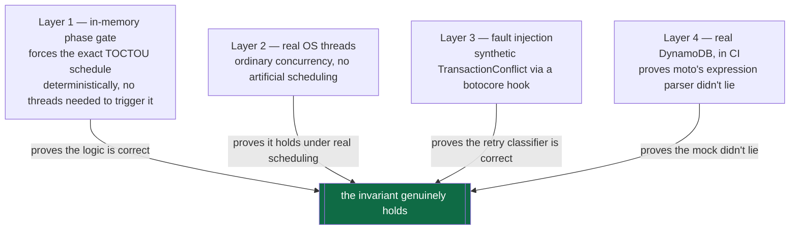
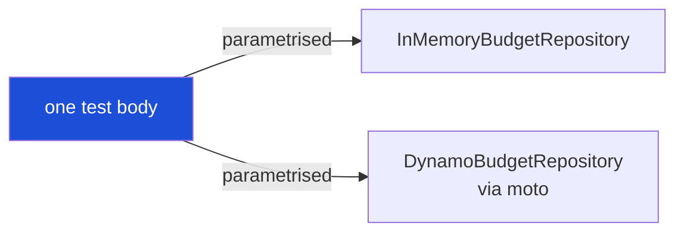

# Testing Strategy

214 tests, seven suites, roughly 30 seconds, no network calls, no spend. This
document explains what each suite is actually for, and the discipline behind the
tests that matter most.

The first rule: **test financial invariants, not HTTP status codes.** A test
that asserts `response.status_code == 429` proves almost nothing on its own —
the tests here additionally assert that committed spend didn't move, that the
provider's invocation count didn't increase, and that
`committed + reserved <= limit` still holds afterward.

---

## Suite map

```
tests/
├── unit/              domain logic in isolation — money, windows, pricing, adapters
├── contract/           the SAME assertions, run against BOTH storage backends
├── concurrency/        the mandated race proofs
├── property/            Hypothesis — thousands of random operation orderings
├── failure_injection/   ambiguous outcomes, crashes, idempotency
├── acceptance/          the specific challenge scenarios, end to end
├── e2e/                 the real FastAPI app — auth, routing, engine, provider
└── support/             shared fixtures and the concurrency test harness
```

```bash
make test               # everything
make test-unit
make test-contract
make test-concurrency   # -p no:xdist — never split across workers, see below
make test-property
make test-failure
make test-acceptance
make test-e2e
make test-ci             # deeper Hypothesis search, for CI
```

---

## The four layers of the race proof

The single most important test in the suite is
`tests/concurrency/test_hard_cap_race.py`: $0.05 remaining, ten concurrent
requests each needing $0.04, exactly one may be authorised, and the provider must
be invoked exactly once.

It is backed by four layers, each proving something the others cannot.



**Layer 1 — the in-memory phase gate is where the strongest proof lives.**
`repo/memory/_txn.py` implements the transaction as an explicit two-phase
`evaluate → commit`, with an injectable hook between them
(`tests/support/concurrency.py::PhaseGate`). A test can force the *exact*
pathological schedule: every one of the ten transactions finishes evaluating its
conditions against the same pristine pre-image before any of them is allowed to
commit. A correct implementation still admits only one, because it re-evaluates
conditions at commit time. A read-then-write implementation admits all ten. This
schedule is constructed deterministically — no thread-timing luck required.

**Layer 2 — real OS threads** (`tests/support/concurrency.py::run_concurrently`),
released together via a `threading.Barrier`, exercise the ordinary concurrent
case with no artificial scheduling.

**Layer 3 — fault injection** via a botocore `before-call` hook that emits a
synthetic `TransactionCanceledException` with `TransactionConflict`, proving the
retry classifier correctly distinguishes a retryable conflict from a terminal
denial (`tests/contract/test_backend_capabilities.py`).

**Layer 4 — real DynamoDB semantics via moto**, run in CI, is what proves moto's
own condition-expression parser agrees with what the production code assumes.
moto cannot manufacture `TransactionConflict` itself (it has no optimistic
concurrency control and serialises requests internally) — which is *why* layer 1
exists as a separate, deterministic proof rather than relying on moto for it.

---

## The mutation-testing discipline

**The hard-cap race test originally passed while being vacuous.** It was first
written with `asyncio.gather`, which runs coroutines cooperatively on one
thread — the ten "concurrent" requests never actually overlapped, because the
critical section contained no `await`. To validate the test, the engine was
deliberately broken (commit-time re-evaluation replaced with read-then-write) and
the *original* test still passed against the broken engine.

The rule this produced, followed for every concurrency-sensitive test since:

> **A race test that has never been observed to fail is not evidence.**

Every test in `tests/concurrency/` and the phase-gate tests in
`tests/contract/` were validated by deliberately breaking the invariant they
claim to protect, confirming the test catches it, and only then trusting the
test. See [FINDINGS.md #F1](FINDINGS.md#f1-the-hard-cap-race-test-was-vacuous--asynciogather-does-not-test-concurrency)
for the full account.

To re-run this validation yourself:

```bash
# In tests/support/concurrency.py, temporarily replace the real MemoryStore
# execute() with a read-then-write version (evaluate once, commit blindly),
# then run:
python -m pytest tests/concurrency/test_hard_cap_race.py -v
# Expect: "10 requests were authorised against a budget that fits one"
```

---

## Why the contract suite runs everything twice



`tests/contract/test_repository_contract.py` writes each assertion **once** and
runs it against both backends via a fixture parameter. This is what stops the
fast in-memory backend from being a comfortable fiction — a behaviour proven
against it is a behaviour the real backend has independently been shown to share,
not merely assumed to.

`tests/contract/test_backend_capabilities.py` is different in kind: it doesn't
test *our* code at all. It tests the **assumptions our code makes about
DynamoDB** — that `ReturnValuesOnConditionCheckFailure` actually returns a
pre-image, that `CancellationReasons` are positionally aligned, that
`SET x = if_not_exists(x, :limit) - :cost` really does create-and-decrement
atomically. These assumptions are load-bearing and version-fragile; if any of
them silently regressed in a future moto or DynamoDB release, this suite fails
loudly at collection time rather than producing a mysterious failure three layers
away.

---

## Property-based testing

`tests/property/test_invariants.py` uses Hypothesis to drive `reserve`,
`reconcile`, `release`, and `mark_pending` in thousands of random orderings and
amounts, asserting after **every single operation**:

```
remaining + committed + reserved == limit
```

This is not redundant with the hand-written scenario tests — it exists to find
the sequence nobody thought to write by hand. Hypothesis shrinks any
counterexample to the shortest failing sequence, which is what makes a property
test failure debuggable rather than a wall of noise.

```bash
make test-property        # default profile — fast, for local iteration
make test-ci               # thorough profile — deeper search, for CI
```

---

## Failure injection

`tests/failure_injection/` proves the system behaves correctly under conditions
that are hard to hit by accident:

| Scenario | What must be true |
|---|---|
| Provider read timeout | Reservation held as `RECONCILE_PENDING`, not released — see [DECISIONS.md #D5](DECISIONS.md#d5-ambiguity-holds-the-money) |
| Provider connect failure | Reservation released — proven not billed |
| Duplicate idempotency key, same body | Second request replays the first response, provider not called again |
| Duplicate idempotency key, different body | `422 idempotency_key_reuse` |
| Idempotency key still in flight | `409 idempotent_request_in_flight` |

---

## Acceptance tests — the challenge scenarios

`tests/acceptance/` maps directly onto the mandated requirements. Each file
targets one behaviour end to end through the driver
(`tests/support/driver.py::Driver`), which runs the real
lifecycle (`count → bound → estimate → reserve → invoke → reconcile`) against the
fake provider — the same order the production `api/service.py` uses.

| File | Proves |
|---|---|
| `test_thresholds_and_hard_cap.py` | Exactly one 80% warning, ever — including under 20 concurrent reconciliations; hard block at exactly 100% |
| `test_token_accounting.py` | Token quotas reject independently of dollar balance |
| `test_session_closure.py` | Both closure paths (exact-cap and would-exceed); a session never actually exceeds its cap |
| `test_runaway_detector.py` | Hour-straddling bursts trip the rolling window; duplicate stream delivery does not manufacture a pause |
| `test_model_substitution.py` | Fallback is capability-checked, verified cheaper, and cannot escape the parent budget |

---

## End-to-end

`tests/e2e/test_api.py` exercises the real FastAPI app — middleware, auth
resolution, routing, the engine, and a fake provider wired through the actual DI
container — rather than calling engine internals directly. The two assertions
that matter most here:

- **Identity cannot be spoofed.** A deliberate `X-Agent-ID` impersonation header
  alongside a real credential is asserted to have zero effect on which budget is
  charged.
- **A rejection costs nothing.** Every denial test also asserts the fake
  provider's invocation count did not increase — the property that actually
  protects the money, not just the HTTP status code.

---

## Adding a new test

1. **Decide what invariant it protects**, not just what behaviour it exercises.
   "Returns 429" is not the invariant; "committed spend does not move and the
   provider is not invoked" is.
2. **If it's concurrency-sensitive**, use `tests/support/concurrency.py`'s
   `run_concurrently` (real threads) or `PhaseGate` (forced schedule) — never
   `asyncio.gather` over code with a synchronous critical section. See
   [FINDINGS.md #F1](FINDINGS.md#f1-the-hard-cap-race-test-was-vacuous--asynciogather-does-not-test-concurrency).
3. **If it touches the repository layer**, add it to
   `tests/contract/test_repository_contract.py` so it runs against both
   backends, not just one.
4. **Validate a new concurrency test by mutation** before trusting it: break the
   invariant on purpose, confirm the test catches it, then fix the break.

---

## Further reading

- [FINDINGS.md](FINDINGS.md) — the bugs this discipline actually caught
- [ARCHITECTURE.md](ARCHITECTURE.md) — what's being tested and why it's shaped this way
